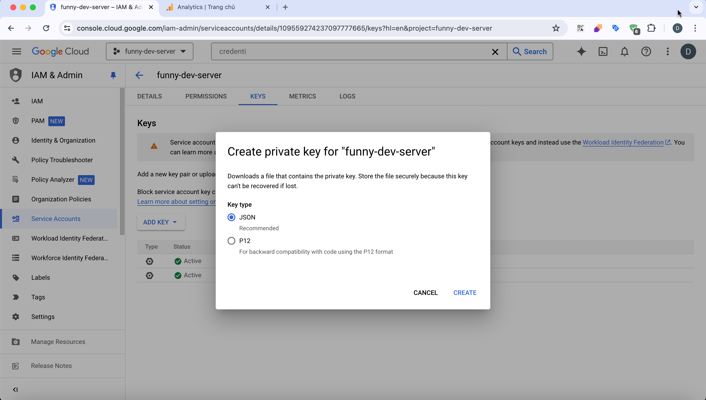

# Google Client Laravel

The free Laravel package to help you wrap your Google Client

## Use Cases

- Wrap your Google Client as an SDK to use it easier

## Features

- Dynamic Google Service credentials from config/google-service.php
- Easy to init and use your Google Service with a simple line code

## Know issues

- This package uses the latest official SDK, libraries and methods from Google then it might be large (around 30mb for dependency package google/apiclient) for shared hosting.
- Please consider your server's environment before using this package.
- However, we still recommend that you follow the latest writing style for Google libraries to ensure safety, compliance, CI/CD and most importantly if you are using services

## Requirements

- **PHP**: 8.1 or higher
- **Laravel** 9.0 or higher

## Quick Start

If you prefer to install this package into your own Laravel application, please follow the installation steps below

## Installation

#### Step 1. Install a Laravel project if you don't have one already

https://laravel.com/docs/installation

#### Step 2. Require the current package using composer:

```bash
composer require funnydevjsc/google-client-laravel-integrate
```

#### Step 3. Publish the controller file and config file

```bash
php artisan vendor:publish --provider="FunnyDev\GoogleClient\GoogleClientServiceProvider" --tag="funnydev-google-client"
```

If publishing files fails, please create corresponding files at the path `config/google-service.php` from this package.

#### Step 4. Create a Google Service credentials:

- Go to https://console.cloud.google.com/iam-admin/serviceaccounts?hl=en&project=your_google_project_id to create a Google Service account.
- Go to https://console.cloud.google.com/iam-admin/serviceaccounts/details/your_google_service_account_id/keys?hl=en&project=your_google_project_id to create a JSON private key file like this:



- Then download it to your computer as <code>application_default_credentials.json</code> and move it to the storage_path of Laravel project but don't forget to ignore it from git to secure your project.

#### Step 5. Update the various config settings in the published config file:

- After publishing the package assets a configuration file will be located at <code>config/google-service.php</code>.
- Please use your Google Service credentials values from <code>application_default_credentials.json</code> to fill into <code>config/google-service.php</code> file.

## Testing

Create a folder
``` php
use FunnyDev\GoogleClient\GoogleClientSdk;

class TestGoogleClient
{
    /**
     * Handle the event.
     * @throws \Exception
     */
    public function handle(): void
    {
        $googleClient = new GoogleClientSdk();
        $googleService = $googleClient->instance();
        $googleService->addScope(...);
    }
}
```

## Feedback

Respect us in the [Laravel Việt Nam](https://www.facebook.com/groups/167363136987053)

## Contributing

Please see [CONTRIBUTING](CONTRIBUTING.md) for details.

### Security

If you discover any security related issues, please email contact@funnydev.vn or use the issue tracker.

## Credits

- [Funny Dev., Jsc](https://github.com/funnydevjsc)
- [All Contributors](../../contributors)

## License

The MIT License (MIT). Please see [License File](LICENSE.md) for more information.
